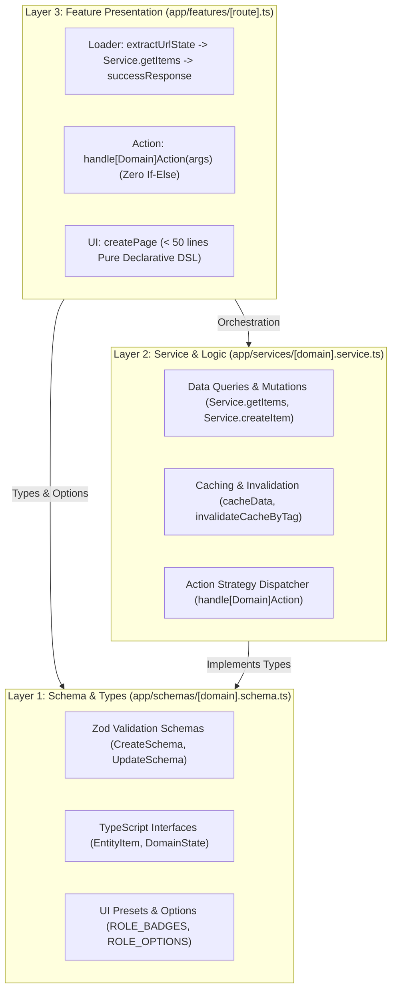

# 📘 PROJECT_CONTEXT.md — Architecture & Engineering Specification

> **Single Source of Truth (SSOT)** for Developers and AI Coding Agents (Cursor, Claude Code, Copilot, Antigravity).

---

## 🏛️ 1. Executive Architecture Summary

This repository implements a **Single-File Hybrid Feature & Zero-Logic DSL Architecture** on top of **React Router v7** and **Vite**, featuring an ultra-concise Functional UI DSL, dynamic route resolution, and strict Domain-Driven Separation of Concerns.

### 🔄 3-Layer Domain-Driven Separation (DDD)



1. **Layer 1: Schema & Types (`app/schemas/[domain].schema.ts`)**
   - Zod Schemas (`CreateUserSchema`, `DeleteUserSchema`).
   - TypeScript Interfaces (`AdminUserItem`, `AdminManageState`).
   - UI Option Presets (`ROLE_OPTIONS`, `STATUS_OPTIONS`, `ROLE_BADGES`, `STATUS_BADGES`).

2. **Layer 2: Service & Business Logic (`app/services/[domain].service.ts`)**
   - Business Logic, DB Queries, and Data Stores.
   - Multi-layer Caching (`cacheData`) & Tag-based Invalidation (`invalidateCacheByTag`).
   - Service Strategy Action Dispatcher (`handleAdminAction`).

3. **Layer 3: Feature Presentation (`app/features/[route].ts`)**
   - Zero-Logic Route Orchestrator (< 50 lines of code).
   - Pure UI Layout DSL composition using declarative composite components.

---

## 🚫 2. Strict Guardrails & Forbidden Patterns

| Category            | ❌ STRICTLY FORBIDDEN                                             | ✅ MANDATORY PATTERN                                                                                           |
| :------------------ | :---------------------------------------------------------------- | :------------------------------------------------------------------------------------------------------------- |
| **Route Syntax**    | Writing raw JSX elements in `.ts` route files                     | Use functional Proxy DSL (`Div()`, `Row()`, `Button()`, `Table()`) from `~/builder`                            |
| **File Structure**  | Splitting routes into `.ui.ts`, `.server.ts`, `.route.ts`         | **Every route = Exactly 1 file** in `app/features/[dot.path].ts`                                               |
| **Action Handlers** | `if (intent === '...')` with inline logic in feature files        | Delegate directly to Service Strategy Dispatcher: `export const action = (args) => handle[Domain]Action(args)` |
| **Validation**      | Manual Zod `.safeParse()` or inline errors in feature routes      | Validate inside the Service Layer and return `errorResponse(parsed.error)`                                     |
| **Modals & Forms**  | Embedding inline modal tags and form markup in route files        | Open registered modals imperatively via `modals.open('MODAL_KEY', { onSubmit })`                               |
| **Confirm Dialogs** | Imperative `Swal.fire({...})` configuration blocks in route files | Use encapsulated dialog helper: `ConfirmDialog.delete({ name, onConfirm })`                                    |
| **URL State**       | Raw search params (`?page=1&search=...`)                          | Use encrypted query state: `extractUrlState<T>(request, defaultState)`                                         |
| **API Responses**   | Returning plain JSON or unhandled throw errors                    | Wrap returns in `successResponse(data)` and catch with `ErrorCatch` + `errorResponse(error)`                   |

---

## ⚡ 3. Standard Route Template (`app/features/sample.ts`)

Standard blueprint for creating any single-file route in under 40 lines of code:

```ts
import type { ActionFunctionArgs } from 'react-router';
import {
  createPage,
  createMeta,
  cacheHeaders,
  CACHE_PRESETS,
  Div,
  Button,
  Select,
  Table,
  ConfirmDialog,
  modals,
  UserAvatarColumn,
  BadgeColumn,
  TextColumn,
  TableActions,
  PageHeader,
  StatsGrid,
  FilterBar,
  successResponse,
  errorResponse,
  type InferLoader,
  type MetaAccessConfig,
} from '~/builder';
import { withMiddleware, withTelemetry, rateLimitMiddleware } from '~/lib/middleware.server';
import { ErrorCatch } from '~/lib/api';
import { extractUrlState } from '~/utils/cryptoState';
import {
  ROLE_BADGES,
  ROLE_OPTIONS,
  type AdminUserItem,
  type AdminManageState,
} from '~/schemas/admin.schema';
import { AdminService, handleAdminAction } from '~/services/admin.service';

export const metaAccess: MetaAccessConfig = {
  roles: ['admin'],
  permissions: ['user:read'],
  redirectTo: '/login',
};
export const meta = createMeta({ title: 'User Management', description: 'Kelola data pengguna.' });
export const headers = cacheHeaders(CACHE_PRESETS.semiStatic);

export const loader = withMiddleware(
  [withTelemetry('loader:admin.manage'), rateLimitMiddleware({ limit: 120, windowMs: 60_000 })],
  async ({ request, user }) => {
    try {
      const state = extractUrlState<AdminManageState>(request, {
        search: '',
        role: 'all',
        status: 'all',
        page: 1,
        isCreateModalOpen: false,
      });
      return successResponse(await AdminService.getUsers(state, user));
    } catch (error) {
      ErrorCatch({ error, context: 'loader:admin.manage' });
      return errorResponse(error);
    }
  }
);
(loader as any).metaAccess = metaAccess;

export const action = (args: ActionFunctionArgs) => handleAdminAction(args);

export default createPage<InferLoader<typeof loader>, any, AdminManageState>(
  (ctx) => {
    const { data, urlState, updateUrlState, send, can } = ctx;
    const post = (intent: string, id: string) => send.submit({ intent, id }, { method: 'post' });

    return Div(
      { className: 'space-y-5 max-w-6xl mx-auto' },
      PageHeader({
        title: ctx.t('dashboard.title'),
        subtitle: ctx.t('dashboard.subtitle'),
        breadcrumbs: ctx.breadcrumbs,
        badges: [{ label: `${data?.totalCount ?? 0} Users`, variant: 'outline' }],
        actions: [
          Button({
            label: 'Tambah User',
            icon: 'UserPlus',
            variant: 'primary',
            size: 'sm',
            guard: 'user:create',
            onClick: () =>
              modals.open('CREATE_USER_MODAL', {
                onSubmit: (v: any) => send.submit(v, { method: 'post' }),
              }),
          }),
        ],
      }),
      StatsGrid([{ label: 'Total User', value: data?.totalCount, icon: 'Users', color: 'cyan' }]),
      FilterBar({
        search: urlState.search,
        onSearchChange: (search) => updateUrlState({ search }),
        filters: [
          Select({
            name: 'role',
            value: urlState.role ?? 'all',
            onChange: (e) => updateUrlState({ role: e.target.value as any }),
            options: ROLE_OPTIONS,
            className: 'w-36',
          }),
        ],
        showReset: Boolean(urlState.search || (urlState.role && urlState.role !== 'all')),
        onReset: () => updateUrlState({ search: '', role: 'all' }),
      }),
      Table<AdminUserItem>({
        data: data?.users ?? [],
        keyField: 'id',
        columns: [
          UserAvatarColumn({ nameKey: 'name', emailKey: 'email' }),
          BadgeColumn({ key: 'role', map: ROLE_BADGES }),
          TextColumn({ key: 'lastActive', header: 'Aktivitas Terakhir' }),
          TableActions<AdminUserItem>([
            {
              icon: 'Trash2',
              variant: 'danger',
              guard: 'user:delete',
              onClick: (u) =>
                ConfirmDialog.delete({ name: u.name, onConfirm: () => post('delete-user', u.id) }),
            },
          ]),
        ],
      })
    );
  },
  { defaultState: { search: '', role: 'all', status: 'all', page: 1, isCreateModalOpen: false } }
);
```

---

## 🗺️ 4. Key Utilities & Modules Map

| Path                                 | Primary Exports / Helpers                                                                                           | Responsibility                                                                                   |
| :----------------------------------- | :------------------------------------------------------------------------------------------------------------------ | :----------------------------------------------------------------------------------------------- |
| **`app/builder.ts`**                 | `createPage`, `createMeta`, `cacheHeaders`, `Div`, `Row`, `Col`, `Button`, `Table`, `Select`, `Input`, `ClientOnly` | Core Hybrid DSL & element rendering engine. Auto-imported across `.ts` files.                    |
| **`app/utils/cryptoState.ts`**       | `extractUrlState<T>()`, `encryptQueryState()`, `decryptQueryState()`                                                | Encrypted URL query state (`?q=...`) for clean, tamper-proof search/filter/pagination.           |
| **`app/utils/apiResponse.ts`**       | `successResponse()`, `errorResponse()`, `ApiError`                                                                  | Standardized API payload wrapping (`{ success, data, error, meta }`).                            |
| **`app/providers/modal.ts`**         | `modals.open()`, `modals.close()`, `GlobalModalRenderer`                                                            | Global reactive modal registry; keeps UI route files clean from modal markup.                    |
| **`app/utils/dialog.ts`**            | `ConfirmDialog.delete()`, `ConfirmDialog.confirm()`, `ConfirmDialog.warning()`                                      | SweetAlert2 wrapper styled with project design tokens (`rounded-3xl`, theme vars).               |
| **`app/components/composite.ts`**    | `PageHeader`, `StatsGrid`, `RbacSimulatorBanner`, `FilterBar`, `UserGrowthChart`                                    | High-level reusable UI composite blocks.                                                         |
| **`app/components/tablePresets.ts`** | `UserAvatarColumn`, `BadgeColumn`, `TextColumn`, `TableActions`                                                     | Reusable declarative column factories for `Table` components.                                    |
| **`app/lib/middleware.server.ts`**   | `withMiddleware`, `withTelemetry`, `rateLimitMiddleware`                                                            | Server-side loader/action middleware pipeline.                                                   |
| **`app/lib/flash.server.ts`**        | `setFlashMessage`, `flashRedirect`, `getFlashMessage`                                                               | Cookie-based flash notification system.                                                          |
| **`app/global-handler.tsx`**         | Global dynamic router & resolution adapter                                                                          | Dynamically resolves loaders, actions, meta, and JSX components from dot-notation feature files. |

---

## 🛠️ 5. Essential CLI Commands

```bash
# Typecheck entire codebase (strict TypeScript check)
bun run typecheck

# Generate routes graph & ROUTES.md manifest documentation
bun run routes:graph

# Production bundle build (Client + SSR)
bun run build

# Code formatting
bun run format
```
