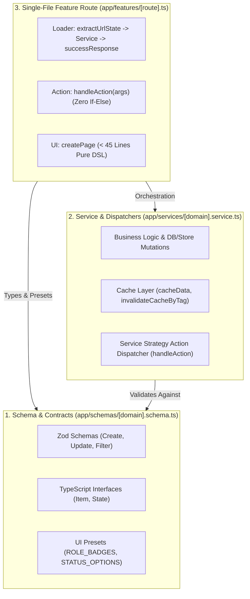

# 📘 PROJECT_DOCUMENTATION.md — Engineering Standards & AI Agent Playbook

> **Target Audience**: AI Coding Agents (Cursor, Claude Code, Copilot, Antigravity) & Core Engineering Contributors.  
> **Repository**: `kinauid-frontend-v2` (`/home/rayhan/Workspaces/Project/portofolio/rayns-verse/kinauid-frontend-v2`)  
> **Status**: Active Living Specification (Single Source of Truth).

---

## 🏛️ 1. Core Architecture: Single-File Route & 3-Layer DDD

This repository is built on **React Router v7 + Vite**, using a strict **Single-File Route Orchestration** powered by a functional **Proxy DSL (`~/builder`)** and **3-Layer Domain-Driven Design (DDD)**.



### 📌 The 3 Layers Explained

1. **Schema Layer (`app/schemas/[domain].schema.ts`)**:
   - Holds Zod validation schemas (`CreateItemSchema`, `UpdateItemSchema`).
   - Exports data models (`ItemType`, `UrlState`).
   - Defines static presentation mappings (`BADGE_MAP`, `STATUS_OPTIONS`).
   - **Zero UI rendering logic or database logic allowed here**.

2. **Service Layer (`app/services/[domain].service.ts`)**:
   - Implements business logic, API requests, and mock/persistent stores.
   - Encapsulates caching (`cacheData`) and cache eviction (`invalidateCacheByTag`).
   - Hosts the **Service Strategy Action Dispatcher** (`handle[Domain]Action(args)`) which routes intents (`create`, `delete`, `update`) without `if-else` cascades.

3. **Feature Presentation Layer (`app/features/[route].ts`)**:
   - Single-file route orchestrator (< 45 lines of code).
   - Resolves via dot-notation routing in `app/global-handler.tsx` (e.g., `app.order-list.ts` $\rightarrow$ `/app/order-list`).
   - **Zero inline business logic, zero raw JSX, zero Zod parsing in route files**.

---

## 🧱 2. Three-Tier Component Hierarchy

Every component in this codebase MUST be placed strictly inside one of the three designated wrapper directories. Placing components directly in the root of `app/components/` is **STRICTLY PROHIBITED**.

```
app/components/
├── core/       # Atomic UI Primitives (No schema/service dependencies)
├── shared/     # Global Composites, Table Presets, Layouts, Stores
└── feature/    # Feature/Domain Specific Widgets (Login, Tickets, Orders)
```

| Tier | Directory | Allowed Imports / Content | Examples |
| :--- | :--- | :--- | :--- |
| **Core** | `app/components/core/` | Atomic primitives, icons, standard HTML elements. **No business logic, no schemas, no services.** | `Button.ts`, `Input.ts`, `Select.ts`, `Card.ts`, `Table.ts`, `Modal.ts`, `Badge.ts`, `TableActionGroup.ts` |
| **Shared** | `app/components/shared/` | Global composites, table column presets, shell layouts, UI state stores. | `PageHeader`, `StatsGrid`, `FilterBar`, `tablePresets.ts`, `LayoutAdmin.ts`, `LayoutPublic.ts`, `useUIStore` |
| **Feature** | `app/components/feature/` | Complex domain-specific widgets, charts, forms, simulation banners, modals. | `FloatingBugReportWidget.ts`, `TicketWidgets.ts`, `LoginViewWidget.ts`, `OrderListWidgets.ts`, `DashboardWidgets.ts` |

---

## 🚫 3. Absolute Prohibitions (Critical AI Guardrails)

Any AI Agent PR or modification violating these rules will be rejected:

### ❌ 1. NO HARDCODED COLOR CODES (Strict Rule)
- **NEVER** write arbitrary hex codes like `bg-[#103557]`, `text-[#0d2740]`, `#1961CC`, `#123456`, or raw `rgb(...)`/`hsl(...)` in component markup or feature routes.
- **ALWAYS** consume colors via:
  1. **Semantic CSS Variables**: `var(--primary)`, `var(--background)`, `var(--foreground)`, `var(--border)`, `var(--muted)`, `var(--profit)`, `var(--loss)`, `var(--warning)`.
  2. **Tailwind Semantic Utility Classes**: `bg-[var(--primary)]`, `text-[var(--primary)]`, `bg-slate-900`, `text-slate-200`, `border-border`, `bg-card`, etc.
  3. **Brand Constants**: `import { BRAND_COLORS } from '~/constants/brand'`.

### ❌ 2. NO RAW JSX IN ROUTE FILES
- Feature files (`app/features/*.ts`) must use the **Proxy DSL** (`createPage`, `Div()`, `Row()`, `Col()`, `Button()`, `Table()`, `PageHeader()`) from `~/builder`.
- Do NOT insert `<div>...</div>` or `<button>...</button>` directly into `app/features/*.ts`.

### ❌ 3. NO INLINE ACTIONS OR INTENT BRANCHING IN ROUTE FILES
- Route `action` MUST delegate directly to the service dispatcher:
  ```ts
  // ✅ MANDATORY
  export const action = (args: ActionFunctionArgs) => handleOrderAction(args);

  // ❌ STRICTLY FORBIDDEN
  export async function action({ request }) {
    const data = await request.formData();
    if (data.get('intent') === 'create') { ... }
  }
  ```

### ❌ 4. NO ROUTE OVER 45 LINES (Sub-45 LOC Rule)
- Feature files are orchestrators only. If a route file approaches 45 lines, delegate UI blocks to `app/components/feature/` or `app/components/shared/`.

### ❌ 5. NO UNPROTECTED PLAIN URL STATE
- State for filtering, searching, and pagination MUST use encrypted state management (`extractUrlState` and `buildEncryptedUrl`). Never read raw `new URL(request.url).searchParams.get('tab')` directly.

---

## 🎨 4. Design System, Tokens & Aesthetics

Our design philosophy is **Dense, Modern, Compact SaaS** (High information density, clean typography, soft borders, zero wasted whitespace).

### Color Token Reference (`app/index.css`)

| Semantic Token | Light Mode Value | Purpose |
| :--- | :--- | :--- |
| `var(--primary)` | `#103557` (KINAU Deep Navy Blue) | Primary actions, branding headers, focused rings |
| `var(--primary-hover)` | `#164e78` | Hover state for primary buttons |
| `var(--accent)` | `#164e78` (Lighter Navy) | Secondary highlights, active chips |
| `var(--background)` | `#ffffff` | Main canvas background |
| `var(--surface)` / `var(--card)` | `#ffffff` | Card panels, floating modals |
| `var(--surface-subtle)` | `#f9fafb` | Inset backgrounds, table header rows |
| `var(--border)` | `#e5e7eb` | Standard subtle container borders |
| `var(--profit)` | `#10b981` (Emerald) | Success messages, paid status, live indicators |
| `var(--warning)` | `#f59e0b` (Amber) | Warnings, pending orders, bug alerts |
| `var(--loss)` | `#ef4444` (Rose/Red) | Destructive actions, system errors, critical bugs |

### Typography
- Primary Sans: `Inter`, system fallback.
- Monospace: `JetBrains Mono` / `Geist Mono` for ticket numbers, IDs, and route paths.

---

## 📊 5. Table & Column Factory Standards (Ready-to-Consume)

Do not reinvent table layouts. Use the ready-to-consume column presets in `app/components/shared/tablePresets.ts`:

```ts
import {
  Table,
  UserAvatarColumn,
  BadgeColumn,
  TextColumn,
  TableActions,
  OrderCodeColumn,
} from '~/builder';
```

### Table Column Presets

1. **`UserAvatarColumn`**:
   Renders name, email, avatar image or 2-letter uppercase initials in a compact row.
   ```ts
   UserAvatarColumn({
     nameKey: 'customer_name',
     emailKey: 'customer_email',
     width: '220px',
   })
   ```

2. **`BadgeColumn`**:
   Maps raw enum values to stylized badges automatically.
   ```ts
   BadgeColumn({
     key: 'status',
     map: ORDER_STATUS_BADGES, // from schema layer
     width: '130px',
   })
   ```

3. **`TextColumn`**:
   Compact monospace or sans text with automatic empty fallback (`—`).
   ```ts
   TextColumn({
     key: 'created_at',
     header: 'Tanggal Dibuat',
     formatter: (val) => formatDate(val),
   })
   ```

4. **`OrderCodeColumn`**:
   Formatted monospace order/ticket code with interactive click callbacks.
   ```ts
   OrderCodeColumn({
     key: 'order_number',
     header: 'No. Order',
     onClick: (order) => modals.open('ORDER_DETAIL', { order }),
   })
   ```

5. **`TableActions`**:
   Clean action buttons with built-in RBAC guard checking (`guard: 'order:delete'`).
   ```ts
   TableActions<OrderItem>([
     {
       icon: 'Eye',
       variant: 'ghost',
       onClick: (row) => navigate(`/app/order-view/${row.id}`),
     },
     {
       icon: 'Trash2',
       variant: 'danger',
       guard: 'order:delete',
       onClick: (row) => ConfirmDialog.delete({
         name: row.order_number,
         onConfirm: () => post('delete-order', { id: row.id }),
       }),
     },
   ])
   ```

### Standard Composite Blocks (`app/components/shared/composite.ts`)

- **`PageHeader`**: Title, subtitle, auto-breadcrumbs, action buttons.
- **`StatsGrid`**: Compact metric boxes with icons and color accents.
- **`FilterBar`**: Search input with debounce, dynamic select dropdowns, reset button.

---

## 🔐 6. Cryptographic State & Navigation Constants

### Centralized Navigation (`app/constants/navigation.ts`)
All menu items, groups, submenus, and badges for `LayoutAdmin` MUST be maintained in:
`app/constants/navigation.ts` (`NAVIGATION_GROUPS`, `NavGroup`, `NavLinkItem`, `SubMenuItem`).
**Never hardcode navigation items inside `LayoutAdmin.ts`.**

### Encrypted URL State (`app/utils/cryptoState.ts`)
- Use `extractUrlState<T>(request, defaultState)` inside loaders.
- Use `updateUrlState({ search: 'query' })` inside DSL components.
- Sanitizes prototype pollution (`__proto__`, `constructor`) and malicious XSS payloads automatically.

---

## 🚀 7. Telemetry, Error Protocol & Bug Diagnostics

### 1. 404 Splat Catch-All Architecture
- Splat route at `app/features/app.$.ts` catches all unregistered `/app/*` paths.
- Renders friendly "Sedang Dikembangkan" state **inside `LayoutAdmin`** without breaking or re-rendering the sidebar.
- `app/builder/breadcrumbs.ts` automatically maps splat `*` or `$` to "Halaman Belum Terdaftar".

### 2. Live Bug Report Diagnostics (`FloatingBugReportWidget.ts`)
- Floating trigger button fixed at `bottom-10 right-2` (above the version badge).
- Automatic **Live Route Detection**: Captures `pathname + search` state and query parameters.
- Automatic **Live Version Detection**: Injects `APP_VERSION` into the diagnostic banner and submits `appVersion` in the bug ticket payload.
- Stores tickets via `SystemService` (`/app/system/tickets`), visible in `TicketWidgets.ts`.

### 3. Server-Side Error Catching
- Every `catch (error)` in services or loaders MUST call:
  ```ts
  import { ErrorCatch } from '~/lib/api';
  // ...
  catch (error) {
    ErrorCatch({ error, context: 'loader:domain.feature' });
    return errorResponse(error);
  }
  ```

---

## 🏷️ 8. Versioning & Git Hook Infrastructure

- **Source of Truth**: `app/constants/version.ts` exports `APP_VERSION = 'vX.X.X'`.
- **Pre-commit Auto Bump**: `hooks/pre-commit` automatically increments the patch version upon every `git commit`.
- **Global Badge**: Fixed bottom-right corner pill in `app/root.tsx` (`bottom: 8px, right: 8px`, `zIndex: 9997`, non-blocking `pointer-events: none`).
- **Setup Command**: Run `bash scripts/setup-hooks.sh` to configure git hook tracking.

---

---

## ☁️ 10. Vercel Deployment & SSR Bundling Architecture

Untuk mencegah error build di Vercel (`unmatched-function-pattern` dan error bundler `pdfkit`):

1. **Vercel Preset (`react-router.config.ts`)**:
   Wajib menggunakan `@vercel/react-router/vite` agar React Router v7 menghasilkan output serverless function sesuai Vercel Build Output API:
   ```ts
   import { vercelPreset } from "@vercel/react-router/vite";
   // ...
   presets: [vercelPreset()],
   ```

2. **Clean `vercel.json`**:
   **DILARANG** menambahkan blok konfigurasi `functions: { "**/*": ... }` di `vercel.json` jika tidak ada direktori `api/` tersendiri, karena Vercel CLI akan gagal melakukan matching serverless functions.
   Cukup pertahankan konfigurasi region:
   ```json
   {
     "regions": ["sin1"]
   }
   ```

3. **Solusi Bundling PDFKit & React-PDF (`vite.config.ts`)**:
   Asset font dan dependensi biner `pdfkit` di-bundle langsung ke runtime SSR melalui `ssr.noExternal` di `vite.config.ts`:
   ```ts
   ssr: {
     noExternal: [
       "@react-pdf/renderer",
       "@react-pdf/font",
       "@react-pdf/layout",
       "@react-pdf/pdfkit",
       "@react-pdf/primitives",
       "@react-pdf/stylesheet",
       "@react-pdf/yoga",
       "pdfkit",
     ],
   },
   ```

---

## ✅ 11. AI Agent Quality Gates (Checklist Sebelum Selesai)

Sebelum menandai pekerjaan Anda selesai, jalankan checklist wajib ini:

```bash
# 1. Typecheck: Wajib 0 errors
bun run typecheck

# 2. Build: Wajib sukses SSR + Client bundle
bun run build
```

| Check Item | Requirement | Passed? |
| :--- | :--- | :--- |
| **File LOC** | `app/features/*.ts` under 45 lines of code | [ ] |
| **No Raw JSX** | Uses `~/builder` DSL in feature files | [ ] |
| **No Hardcoded Hex** | Colors use `var(--...)` or Tailwind semantic tokens | [ ] |
| **Component Placement** | Placed in `core/`, `shared/`, or `feature/` (never root) | [ ] |
| **Navigation** | Items declared in `app/constants/navigation.ts` | [ ] |
| **Version Alignment** | Imports `APP_VERSION` from `~/constants/version` | [ ] |
| **Vercel Config** | Clean `vercel.json` without invalid `functions` | [ ] |
| **String Error Safety** | Action errors return string or unpacked error | [ ] |
